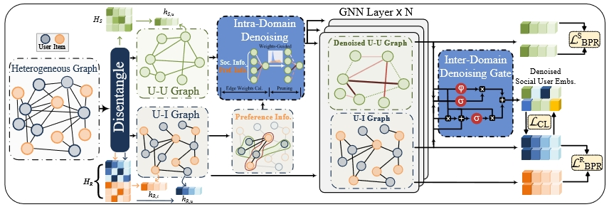

# HDSR: Hierarchical Denoising for Robust Social Recommendation 
This is the Torch implementation for our paper:

>Hu Z, Nakagawa S, Zhuang Y, et al. Hierarchical Denoising for Robust Social Recommendation[J]. IEEE Transactions on Knowledge & Data Engineering, 2024 (01): 1-14.

## Introduction

Social recommendations leverage social networks to augment the performance of recommender systems. However, the critical task of denoising social information has not been thoroughly investigated in prior research. In this study, we introduce a hierarchical denoising robust social recommendation model to tackle noise at two levels: (1) intra-domain noise, resulting from user multi-faceted social trust relationships, and (2) inter-domain noise, stemming from the entanglement of the latent factors over heterogeneous relations (e.g., user-item interactions, user-user trust relationships). Specifically, our model advances a preference and social psychology-aware methodology for the fine-grained and multi-perspective estimation of tie strength within social networks. This serves as a precursor to an edge weight-guided edge pruning strategy that refines the model's diversity and robustness by dynamically filtering social ties. Additionally, we propose a user interest-aware cross-domain denoising gate, which not only filters noise during the knowledge transfer process but also captures the high-dimensional, nonlinear information prevalent in social domains.

## Environment Requirement
Please refer to `requirements.txt`

## Quick Start

### Data
All the data for our experiments are in the `data` folder. For each dataset, the data is split into training, validation, and test sets. `SG.txt` means "Social Graph" stores the social relationships between users.

### Run the Code
The code is provided in `src`. `config` folder contains the config files with best hyperparameter for each dataset. Change the `config['dataset']=dataset` in the `run_HDSR.py` and run the file will automatically load the best hyperparameter and train the model under a fixed seed.

## Citation 
If you are interested in our work, please cite:
```
@article{hu2024hierarchical,
  title={Hierarchical Denoising for Robust Social Recommendation},
  author={Hu, Zheng and Nakagawa, Satoshi and Zhuang, Yan and Deng, Jiawen and Cai, Shimin and Zhou, Tao and Ren, Fuji},
  journal={IEEE Transactions on Knowledge \& Data Engineering},
  number={01},
  pages={1--14},
  year={2024},
  publisher={IEEE Computer Society}
}
```
